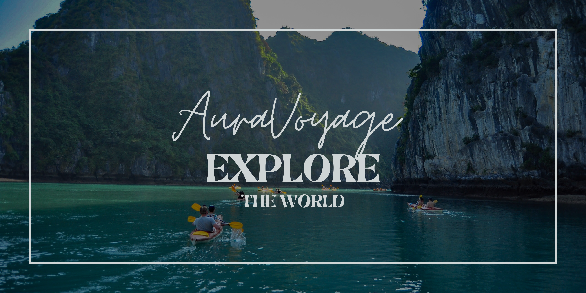

<p align="center">
  
</p>

---

# 🌍 AuraVoyage – Travel & Tourism Website

## ✈️ Overview

**AuraVoyage** is a modern and responsive Travel & Tourism website developed using **React**, **Vite**, and **Bootstrap 5**. It provides travelers with an engaging interface to explore destinations, learn about countries, and experience a clean, interactive user interface.

This project focuses on creating an attractive frontend experience with reusable React components, responsive layouts, and seamless navigation.

---

## ✨ Features

* 🏝️ Beautiful Landing Page
* 🌎 Explore Popular Destinations
* 📍 Destination Details Page
* 🔍 Dynamic Routing with React Router
* 📱 Fully Responsive Design
* ⚡ Fast Performance with Vite
* 🎨 Modern UI/UX
* 📬 Contact Page
* 👨‍💼 About Page
* 🌐 Country Information using REST Countries API
* ♻️ Reusable React Components

---

## 🛠️ Tech Stack

| Technology         | Purpose                  |
| ------------------ | ------------------------ |
| React              | Frontend Library         |
| Vite               | Development & Build Tool |
| Bootstrap 5        | Responsive UI Framework  |
| React Router DOM   | Client-side Routing      |
| REST Countries API | Country Information      |
| CSS3               | Custom Styling           |
| JavaScript (ES6+)  | Application Logic        |

---

## 📂 Project Structure

```text
AuraVoyage/
│── public/
│── src/
│   ├── assets/
│   ├── components/
│   ├── pages/
│   ├── layouts/
│   ├── services/
│   ├── App.jsx
│   └── main.jsx
│
├── package.json
├── vite.config.js
└── README.md
```

---

## 🚀 Getting Started

### Clone the Repository

```bash
git clone https://github.com/harvir011/AuraVoyage.git
```

### Navigate into the Project

```bash
cd AuraVoyage
```

### Install Dependencies

```bash
npm install
```

### Start Development Server

```bash
npm run dev
```

Open your browser and visit:

```text
http://localhost:5173
```

---

## 📸 Pages Included

* 🏠 Home
* 🌍 Destinations
* 📍 Destination Details
* ℹ️ About
* 📬 Contact

---

## 🎯 Project Objectives

* Build a responsive tourism website using React.
* Demonstrate component-based architecture.
* Implement client-side routing.
* Consume a public REST API.
* Deliver a clean and engaging user experience.

---

## 🔮 Future Enhancements

* 🔐 User Authentication
* ❤️ Favorite Destinations
* 🔍 Advanced Search & Filters
* 🗺️ Interactive Maps
* 🌤️ Live Weather Integration
* 💳 Booking System
* 🌙 Dark Mode
* ⭐ Destination Reviews & Ratings

---

## 🤝 Contributing

Contributions are welcome!

Feel free to fork this repository, create a feature branch, and submit a Pull Request.

---

## 📄 License

This project is developed for educational purposes.

---

## 👨‍💻 Author

Developed with ❤️ using **React**, **Vite**, and **Bootstrap 5**.

If you found this project helpful, don't forget to ⭐ the repository!


